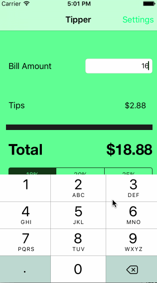

# TipCalculator

This is a Tip Calculator application for iOS submitted as the Vinh Quang Pham requirement for CodePath.

Time spent: 1.5 hours total

Completed:

* [x] Required: User can enter a bill amount, choose a tip percentage, and see the tip and total values.
* [x] Required: Settings page to change the default tip percentage.
* [x] Optional: UI animations
* [x] Optional: Using locale-specific currency and currency thousands separators.
* [x] Optional: Making sure the keyboard is always visible and the bill amount is always the first responder. This way the user doesn't have to tap anywhere to use this app. Just launch the app and start typing.

Walkthrough of required and optional user stories

